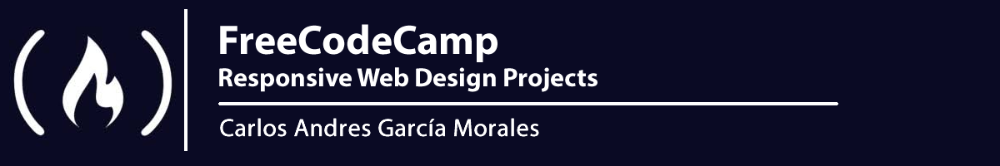

# Introduction to the Responsive Web Design Projects

Time to put your newly learnt skills to work! By working on projects you would have the opportunity of applying all the skills, principles and concepts you have learnt so far HTML, CSS, Visual Design, Accessibility, etc.

In this section you get the chance to:

- [Build a Tribute Page](Tribute_Page/)
- [Build a Survey Form](Survey_Form/)
- [Build a Product Landing Page](Product_Landing_Page/)
- [Build a Technical Documentation Page](Technical_Documentation_Page/)
- [Build a Personal Portfolio Webpage](Personal_Portfolio_Webpage/)

By the end of this, you would have 5 responsive websites under your belt that you can show off to friends, family, employers, etc. Have fun and remember to use the Read-Search-Ask method if you get stuck.

## :sagittarius: Author

> :man: Carlos Andres Garcia Morales

> :e-mail: [E-mail](agzsoftsi@gmail.com)

> :octocat: [Github](https://github.com/agzsoftsi)

> :bird: [Twiiter](https://twitter.com/karlgarmor)

> :blue_book: [Linkedin](https://twitter.com/karlgarmor)

> :globe_with_meridians: [WebPage](https://www.agzsoftsi.tech/)